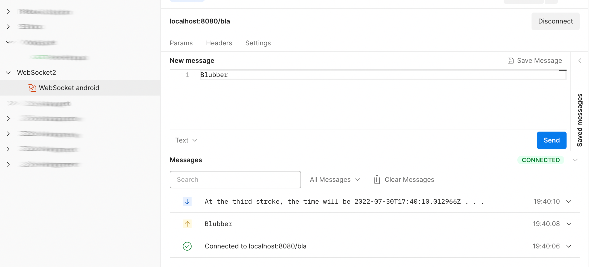

# Minimalistic Spring WebSocket server

## Requirements

* Maven
* Java 18
* A suitable WebSocket client (i.e. postman)

## Usage

* At first start the server

```shell
mvn spring-boot:run
```

* Then connect with Your WebSocket client

## Features

* Every ten seconds, a text message is sent to all active clients
* Received messages are logged in the server log


